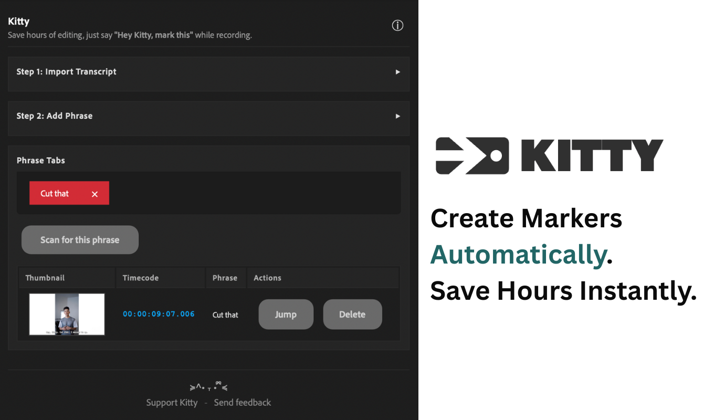

# 🐾 Kitty — Smart Marker Assistant for Adobe Premiere Pro (Beta)

**Kitty** helps you create **timeline markers automatically** from your transcript phrases.  
Say things like **“Hey Kitty, cut that”** while recording. Later, import your transcript and let Kitty scan and mark those moments for you.

🔗 **Demo video:** https://vimeo.com/1135841018

> ⚠️ **Premiere Pro (Beta) required.**  
> UXP plugins like Kitty currently run in **Premiere Pro (Beta)**. When Adobe enables UXP in the stable release, Kitty will support that too.

---

## ✨ Features
- Create markers automatically from phrases in your transcript (SRT/VTT).
- Add your own phrases (e.g., *cut that*, *good shot*).
- Choose marker colors and scan in one click.
- Jump to markers quickly from the results list.
- Simple UI; no cloud upload required.

---

## 📦 Download & Install

1. **Download the latest `com.kittystudio.kitty_beta.ccx`** from this repo’s main page (or Releases).
2. Open **Creative Cloud Desktop** → **Plugins** → **Install from file**.
3. Select the `com.kittystudio.kitty_beta.ccx` file and install.
4. Open **Premiere Pro (Beta)** → **Plugins** → **Kitty**.

> If install doesn’t start, update Creative Cloud Desktop to the latest version, then try again.

---

## 🎥 How to Use

1. Record as normal. Say simple cues like **“Hey Kitty cut that”** when something goes wrong, or **“Hey Kitty good shot”** when it’s a keeper.
2. In Premiere, generate a transcript (Speech-to-Text):  
   **Window → Text → Captions → Transcribe / Generate Captions**
3. Open **Kitty** → **Import transcript** (`.srt` or `.vtt`).
4. Add your phrase(s) (e.g., `cut that`, `good shot` or just `“Hey Kitty` to access all) → click **Scan**.
5. Kitty creates markers on your sequence at each match.

---

## 🛠 Requirements
- **Adobe Premiere Pro (Beta)**
- macOS or Windows supported by Premiere (Beta)

---

## ❓ FAQ

**Does Kitty “listen” while I record?**  
No. Kitty works **after** you import the transcript. It searches the text and makes markers.

**Can I use Kitty in the regular Premiere?**  
Not yet. UXP support is currently in Beta. When Adobe ships UXP in stable Premiere, Kitty will support it.

**Does Kitty upload my transcript?**  
No. Scanning happens locally inside the extension.

---

## 🐞 Feedback & Support
- Share bugs and feature requests: **r/KittyStudio** (Reddit)
- Or open a GitHub issue in this repo
- If Kitty saved you time, you can support development via **Buy Me a Coffee** (link on the website/repo if available)

---

## 🗒 Changelog
- **v1.0.0** — Initial beta release (scan transcript phrases → create markers)